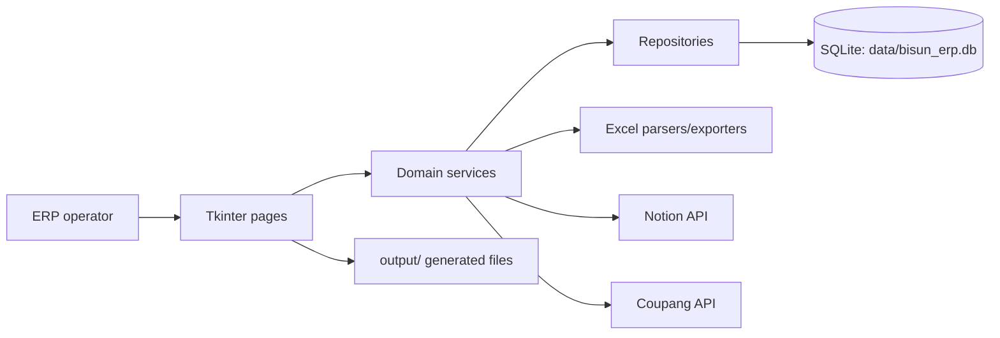
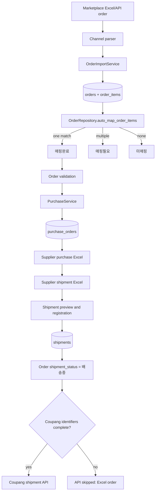

# Bisun ERP Architecture

## Scope

This document describes the implementation at the `v3.0-workflow-checkpoint` tag on the `feature/workflow` branch. Bisun ERP is a Python desktop application using Tkinter/ttk, SQLite, pandas/openpyxl-based Excel integration, and optional marketplace/Notion integrations.

## Runtime architecture

- `main.py` initializes the database and launches `app.main_window.MainWindow`.
- `app/main_window.py` owns navigation. Existing pages are preserved; the Command Center is an additional page.
- Feature packages under `modules/` generally separate page, service, repository, and parser/export responsibilities.
- `core/database.py` creates the core schema. Some feature repositories create their own tables and indexes with `CREATE TABLE/INDEX IF NOT EXISTS`.
- SQLite is the system of record for operational data. Notion is the intended master for suppliers, products, and supplier-product conditions.

## Module map

| Area | Main modules | Responsibility |
|---|---|---|
| Shell | `main.py`, `app/main_window.py`, `app/widgets/` | Startup, navigation, common widgets |
| Orders | `modules/orders/` | Channel Excel detection/parsing, preview, duplicate handling, persistence, auto-mapping |
| Mapping | `modules/mappings/`, `modules/mapping_engine/` | Rule-based product resolution and mapping UI |
| Validation | `modules/order_validation/`, `modules/operations_check/` | Order readiness rules and operator checks |
| Purchasing | `modules/purchases/` | Purchase candidates, supplier grouping, purchase rows, Excel output |
| Purchase planning | `modules/purchase_ai/`, `modules/purchase_dashboard/` | Optional supplier plans, quantities, optimization views |
| Shipments | `modules/shipments/` | Supplier return-file parsing, format mapping, preview, registration, shipment views |
| Coupang | `modules/coupang/` | API order links, scheduler, shipment API transmission/logging |
| Notion | `modules/notion_sync/` | Database discovery, preview, master-data upsert/deactivation, sync logs |
| Command Center | `modules/command_center/` | Daily KPIs, navigation/actions, exceptions, action logs |
| Supporting domains | `customers`, `claims`, `payments`, `settlements`, `delivery`, `receipts`, `statistics` | Secondary ERP functions |
| Content tools | `detail_studio`, `templates` | Product-detail content projects and exports |
| Operations | `settings`, `backup_manager`, `integrity`, `alerts`, `search`, `management` | Configuration and operational utilities |

## Core workflow

## Notion integration

Notion integration discovers or uses saved IDs for the existing Supplier, Product, and Product Mapping/Condition databases. Sync upserts records by Notion page ID and stable business keys, records timestamps and outcomes, and safely deactivates Notion-owned records no longer returned. Product Management consumes the same `products` table and full-product sync uses `NotionProductSyncService.sync_products()`.

## Command Center

The Command Center is an orchestration and visibility layer, not a replacement for feature pages. It reads KPIs and exceptions from current repositories, navigates to existing screens, invokes production auto-mapping through `OrderRepository.auto_map_order_items()`, and logs only actions initiated there. Channel shipment export remains disabled as “준비 중”.

## Purchase architecture

`PurchaseService` selects only fully mapped candidates, validates supplier/product purchasing data, groups work by supplier, creates or updates `purchase_orders`, and emits supplier-specific Excel files below `output/발주서`. The `order_item_id` uniqueness rule prevents duplicate purchasing for one order line.

## Shipment architecture

Shipment Management supports legacy supplier parsers and a generic supplier-specific column mapping. `supplier_shipment_formats` stores a 1-based header row and column positions by supplier ID. The configurable parser preserves tracking identifiers as text, previews rows, and lets `ShipmentService` register valid rows independently. `ShipmentRepository` rejects duplicate item registrations and duplicate tracking numbers used by another order, writes the shipment, updates purchase state, and moves the order to `배송중`.

For Coupang, API transmission is downstream of local shipment registration. Missing `shipmentBoxId`, `orderId`, or `vendorItemId` causes a distinguishable “API skipped (Excel order)” result without an API failure log. Complete identifiers still produce genuine API success/failure handling.

## Git and release model

- Stable baseline: `main` / `origin/main` at the v2.8 baseline.
- Workflow development: `feature/workflow`.
- Verified workflow commit: `878470a`.
- Release-preparation commit: `e829ff1`.
- Checkpoint tag: `v3.0-workflow-checkpoint` at `e829ff1`.
- Runtime artifacts are ignored; source-controlled Excel templates/samples remain trackable.
- No merge into `main` is part of this checkpoint.

## OMS preparation

The current ERP already has channel parsers, normalized order/order-item records, Coupang-specific API-link tables, shipment persistence, and export services. A full OMS layer still requires a generic per-order/per-item channel metadata store, complete preservation of raw imported columns, reliable identifiers for SmartStore and other channels, channel export logs/idempotency, and channel adapters with explicit schemas. These should extend the workflow without replacing the production repositories.
