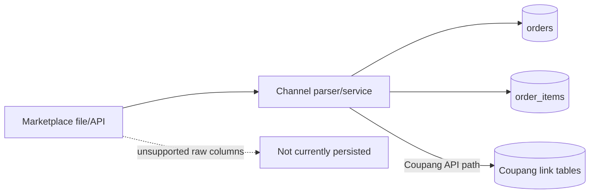

# Channel Metadata

## Current state

The normalized ERP schema preserves common operational order data in `orders` and `order_items`. It does **not** yet provide a generic raw channel-metadata table or JSON column. Therefore, only fields explicitly mapped by parsers or saved in Coupang link tables are durable.

## Common preserved fields

| Scope | Fields |
|---|---|
| Order | `platform`, `order_number`, `ordered_at`, recipient/contact/address/message, workflow statuses, `total_amount`, `source_file` |
| Item | marketplace product name, option name, quantity, unit/total price, mapping status, ERP product and supplier links |

`platform` is the normalized parser platform name. A separate “original platform name” field is not present. Additional original columns are not stored as JSON in this checkpoint.

## Coupang

### Preserved by normalized Excel import

- Platform (`orders.platform`)
- Order number (`orders.order_number`)
- Order/product/recipient values supported by `CoupangOrderExcelParser`

### Preserved by Coupang API synchronization

- Coupang order ID: `coupang_order_links.coupang_order_id`
- Bundle shipment / shipment box ID: `coupang_order_links.shipment_box_id` and item link
- Vendor item ID: `coupang_order_item_links.vendor_item_id`
- Seller product ID
- External vendor SKU
- Original shipping, cancellation, and cancellation-hold counts
- Raw Coupang status

The current item link does not define a separately named `option_id`. API shipment transmission requires shipment box ID, order ID, and vendor item ID; Excel-only orders may lack them and are safely skipped after local shipment registration.

## Naver SmartStore

The SmartStore parser reads both order number and product order number to parse and group the workbook, plus sales channel, product, option, quantity, amount, recipient, contact, address, and cancellation/return status inputs. In the current normalized persistence:

- Order number is retained in `orders.order_number`.
- Platform is retained in `orders.platform`.
- Product/option and operational order data are retained.
- Product order number is **not** stored in a dedicated durable column.
- Delivery method and original sales-channel value are **not** stored in dedicated durable columns.
- Unmapped original columns are not preserved as JSON.

These gaps block a trustworthy SmartStore shipment-upload exporter without revisiting import persistence.

## Future channel readiness

| Channel | Current preparation | Metadata needed before reliable export/API |
|---|---|---|
| Auction | ESM parser coverage exists | Original order/item IDs, seller/channel code, delivery method, raw JSON |
| Gmarket | ESM parser coverage exists | Original order/item IDs, seller/channel code, delivery method, raw JSON |
| 11st | No dedicated persistence contract documented | Order/item IDs, option/vendor identifiers, delivery type, raw JSON |
| LotteOn | Parser module exists | Platform order/item identifiers, delivery attributes, raw JSON |
| Toss | Parser module exists | Platform order/item identifiers, delivery attributes, raw JSON |

## Recommended generic model

Future work should add metadata without changing the existing order workflow:

- One metadata record per ERP order or order item.
- Normalized `platform` plus `original_platform_name`.
- Explicit channel identifiers needed for shipment export/API calls.
- `raw_metadata_json` for all additional source columns.
- Import-version/source-file provenance.
- Backward-compatible “unavailable” values for historical orders.
- A channel export log keyed by shipment and channel for idempotency/re-export control.

No such schema is claimed to exist at the v3.0 checkpoint.
