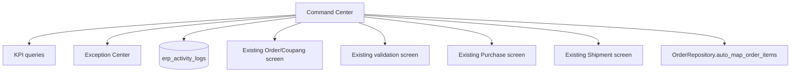

# ERP Command Center

## Purpose

The Command Center provides a single daily-operations screen while retaining every existing ERP page and business service. It is a dashboard/orchestrator, not a duplicate implementation of order, purchase, or shipment logic.

## Widgets

| Widget | Meaning |
|---|---|
| 오늘 주문 | Orders created/received today |
| 미매핑 주문 | Orders whose mapping is incomplete |
| 발주 대기 | Purchase work awaiting completion |
| 송장 대기 | Purchased order items without shipment records |
| 배송중 | Orders currently in shipping state |
| 실패 작업 | Failed Command Center activity-log entries |
| 오늘 발주금액 | Purchase amount for today |
| 오늘 매출금액 | Sales amount for today |

The page includes a manual refresh action. Counts and totals come from the current database and service queries.

## Buttons

| Button | Current behavior |
|---|---|
| 주문 동기화 | Navigates to the existing Coupang/order synchronization screen |
| 자동매핑 | Calls `OrderRepository.auto_map_order_items()` only when clicked |
| 주문 검수 | Navigates to the existing operations/validation screen |
| 발주 생성 | Navigates to existing Purchase Management |
| 송장 등록 | Navigates to existing Shipment Management |
| 채널별 송장파일 생성 - 준비 중 | Disabled until general channel export is implemented |

The service deliberately avoids eager `AutomationService`/legacy runner imports, so unavailable optional legacy modules cannot prevent ERP startup.

## Exception Center

The exception list summarizes operator-actionable conditions:

- Unmapped products/orders
- Missing supplier assignments
- Shipment errors
- Duplicate tracking numbers
- Import errors

It is a triage view; correction continues in existing feature screens.

## Activity Log

`erp_activity_logs` records:

- Time (`created_at`)
- Action
- Result status
- Result message
- Optional structured details JSON

Initial logging scope is intentionally limited to actions started from the Command Center. Navigation actions and automatic mapping outcomes are recorded as success or failure. The log is indexed by time and result status, and failed entries feed the Failed Jobs widget.

## Failure isolation

- Construction of the Command Center does not import the legacy automation runner.
- Business operations remain owned by their production repositories/services.
- A failed optional action is reported and logged without preventing application startup.
- Existing Dashboard remains unchanged and available separately.
