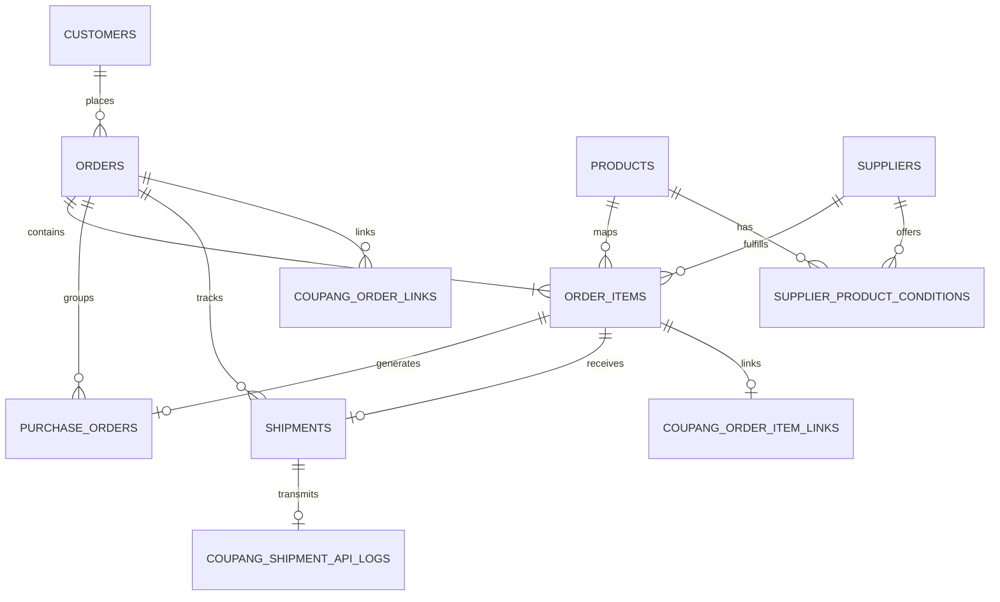

# Database Reference

## Scope and conventions

This is a read-only catalog of the 28 application tables present in `data/bisun_erp.db` at the v3.0 workflow checkpoint. `*` marks a primary key. SQLite foreign-key enforcement is enabled by `Database.connect()`. Feature repositories may initialize their own schema in addition to `core/database.py`.

## Operational core

### `suppliers`

Purpose: supplier master, including purchasing defaults and Notion identity.

- Columns: `id* INTEGER`, `supplier_code TEXT`, `supplier_name TEXT`, `contact_name TEXT`, `phone TEXT`, `email TEXT`, `bank_name TEXT`, `bank_account TEXT`, `account_holder TEXT`, `address TEXT`, `memo TEXT`, `is_active INTEGER`, `created_at TEXT`, `updated_at TEXT`, `order_method TEXT`, `default_courier TEXT`, `default_shipping_fee INTEGER`, `settlement_method TEXT`, `handled_items TEXT`, `notion_page_id TEXT`, `notion_last_edited_time TEXT`.
- Relationships: parent of supplier conditions, product-supplier rows, purchase orders, shipment formats, deadlines, and scores; optional parent of products/order items/shipments.
- Indexes: unique `supplier_code`.

### `products`

Purpose: ERP product master synchronized from Notion and used by mapping/purchasing.

- Columns: `id* INTEGER`, `product_code TEXT`, `platform TEXT`, `platform_product_name TEXT`, `product_name TEXT`, `option_name TEXT`, `supplier_id INTEGER`, `supplier_product_name TEXT`, `purchase_price INTEGER`, `sale_price INTEGER`, `purchase_round TEXT`, `is_active INTEGER`, `created_at TEXT`, `updated_at TEXT`, `category TEXT`, `sale_unit TEXT`, `season TEXT`, `origin TEXT`, `packaging_type TEXT`, `sales_status TEXT`, `notion_page_id TEXT`, `notion_last_edited_time TEXT`, `purchase_unit TEXT`, `purchase_deadline TEXT`, `notion_last_sync TEXT`, `sync_status TEXT`, `sync_message TEXT`.
- Relationships: `supplier_id -> suppliers.id` (`SET NULL`); referenced by order items, mapping rules, supplier conditions, product suppliers, and purchase-plan items.
- Indexes: unique `product_code`; `idx_products_notion_page_id(notion_page_id)`.

### `supplier_product_conditions`

Purpose: Notion-capable supplier/product offer and purchasing condition.

- Columns: `id* INTEGER`, `product_id INTEGER`, `supplier_id INTEGER`, `supplier_product_name TEXT`, `supplier_product_code TEXT`, `purchase_price INTEGER`, `minimum_order_quantity INTEGER`, `package_unit INTEGER`, `package_unit_name TEXT`, `shipping_fee INTEGER`, `courier_name TEXT`, `order_deadline TEXT`, `is_default INTEGER`, `is_active INTEGER`, `source TEXT`, `notion_page_id TEXT`, `created_at TEXT`, `updated_at TEXT`, `notion_last_edited_time TEXT`.
- Relationships: `product_id -> products.id` and `supplier_id -> suppliers.id`, both `CASCADE`.
- Indexes: unique `(product_id, supplier_id)`; `idx_spc_product_active(product_id, is_active)`.

### `product_suppliers`

Purpose: product-to-supplier commercial data used by product and purchasing screens.

- Columns: `id* INTEGER`, `product_id INTEGER`, `supplier_id INTEGER`, `supplier_product_name TEXT`, `supplier_product_code TEXT`, `purchase_price INTEGER`, `minimum_order_quantity INTEGER`, `package_unit_qty INTEGER`, `package_unit_name TEXT`, `shipping_fee INTEGER`, `carrier TEXT`, `order_deadline TEXT`, `is_default INTEGER`, `is_active INTEGER`, `created_at TEXT`, `updated_at TEXT`.
- Relationships: `product_id -> products.id` (`CASCADE`), `supplier_id -> suppliers.id`.
- Indexes: unique `(product_id, supplier_id)`; `idx_product_suppliers_product(product_id, is_active)`.

### `customers`

Purpose: customer and delivery-contact master.

- Columns: `id* INTEGER`, `customer_type TEXT`, `business_name TEXT`, `customer_name TEXT`, `phone TEXT`, `email TEXT`, `postal_code TEXT`, `address TEXT`, `detail_address TEXT`, `business_number TEXT`, `representative_name TEXT`, `memo TEXT`, `created_at TEXT`, `updated_at TEXT`.
- Relationships: referenced by orders and payments.
- Indexes: none.

### `orders`

Purpose: normalized marketplace order header and workflow states.

- Columns: `id* INTEGER`, `platform TEXT`, `order_number TEXT`, `ordered_at TEXT`, `customer_id INTEGER`, `receiver_name TEXT`, `receiver_phone TEXT`, `postal_code TEXT`, `address TEXT`, `detail_address TEXT`, `delivery_message TEXT`, `order_status TEXT`, `payment_status TEXT`, `mapping_status TEXT`, `purchase_status TEXT`, `shipment_status TEXT`, `total_amount INTEGER`, `source_file TEXT`, `created_at TEXT`, `updated_at TEXT`.
- Relationships: `customer_id -> customers.id` (`SET NULL`); parent of order items, purchases, shipments, claims, settlements, payments, and Coupang links.
- Indexes: unique `(platform, order_number)`.

### `order_items`

Purpose: normalized order lines and their ERP product/supplier mapping.

- Columns: `id* INTEGER`, `order_id INTEGER`, `product_id INTEGER`, `platform_product_name TEXT`, `option_name TEXT`, `quantity INTEGER`, `unit_price INTEGER`, `total_price INTEGER`, `supplier_id INTEGER`, `purchase_round TEXT`, `mapping_status TEXT`, `created_at TEXT`, `updated_at TEXT`.
- Relationships: `order_id -> orders.id` (`CASCADE`), `product_id -> products.id` and `supplier_id -> suppliers.id` (`SET NULL`); parent of purchase and channel item links.
- Indexes: none.

### `product_mapping_rules`

Purpose: reusable platform product/option to ERP product mapping rules.

- Columns: `id* INTEGER`, `platform TEXT`, `platform_product_name TEXT`, `option_name TEXT`, `product_id INTEGER`, `is_active INTEGER`, `created_at TEXT`, `updated_at TEXT`.
- Relationships: `product_id -> products.id`.
- Indexes: unique `(platform, platform_product_name, option_name)`.

## Purchase and shipment

### `purchase_orders`

Purpose: operational supplier purchase lines generated from mapped order items.

- Columns: `id* INTEGER`, `supplier_id INTEGER`, `order_id INTEGER`, `order_item_id INTEGER`, `supplier_name TEXT`, `order_number TEXT`, `product_name TEXT`, `option_name TEXT`, `quantity INTEGER`, `receiver_name TEXT`, `receiver_phone TEXT`, `postal_code TEXT`, `address TEXT`, `delivery_message TEXT`, `purchase_status TEXT`, `purchase_file TEXT`, `purchased_at TEXT`, `created_at TEXT`, `updated_at TEXT`, `supplier_product_code TEXT`, `unit_price INTEGER`, `item_amount INTEGER`, `shipping_fee INTEGER`, `carrier TEXT`, `order_deadline TEXT`, `minimum_order_quantity INTEGER`, `package_unit_qty INTEGER`, `package_unit_name TEXT`, `purchase_round TEXT`.
- Relationships: supplier `SET NULL`; order and order item `CASCADE`.
- Indexes: unique `order_item_id` (represented twice by historical schema); `idx_purchase_orders_status_date(purchase_status, purchased_at)`.

### `shipments`

Purpose: saved carrier/tracking data for order lines.

- Columns: `id* INTEGER`, `order_id INTEGER`, `courier_name TEXT`, `tracking_number TEXT`, `shipment_status TEXT`, `shipped_at TEXT`, `delivered_at TEXT`, `memo TEXT`, `created_at TEXT`, `updated_at TEXT`, `order_item_id INTEGER`, `supplier_id INTEGER`.
- Relationships: declared `order_id -> orders.id` (`CASCADE`). The migrated `order_item_id` and `supplier_id` are logical references but are not declared as foreign keys in the inspected live schema.
- Indexes: `idx_shipments_status(shipment_status)`, `idx_shipments_tracking(tracking_number)`, `idx_shipments_shipped_at(shipped_at)`.

### `supplier_shipment_formats`

Purpose: generic returned-shipment Excel layout by supplier ID.

- Columns: `supplier_id* INTEGER`, `header_row INTEGER`, `order_number_column INTEGER`, `carrier_column INTEGER`, `tracking_number_column INTEGER`, `created_at TEXT`, `updated_at TEXT`.
- Relationships: `supplier_id -> suppliers.id` (`CASCADE`).
- Indexes: primary key only.

### `purchase_plan`

Purpose: optional supplier-level purchase optimization/planning header.

- Columns: `id* INTEGER`, `supplier_id INTEGER`, `supplier_name TEXT`, `order_count INTEGER`, `item_count INTEGER`, `total_quantity INTEGER`, `estimated_amount INTEGER`, `deadline_time TEXT`, `status TEXT`, `created_at TEXT`, `updated_at TEXT`, `recommended_reason TEXT`, `priority INTEGER`, `confirmed INTEGER`, `product_amount INTEGER`, `shipping_fee INTEGER`, `savings_amount INTEGER`, `optimization_mode TEXT`.
- Relationships: `supplier_id -> suppliers.id` (`SET NULL`); parent of plan items.
- Indexes: `idx_purchase_plan_created_at(created_at)`, `idx_purchase_plan_supplier(supplier_id, status)`, `idx_purchase_plan_priority(priority, status)`.

### `purchase_plan_item`

Purpose: optional optimized purchase-plan lines and quantity calculations.

- Columns: `id* INTEGER`, `plan_id INTEGER`, `order_id INTEGER`, `order_item_id INTEGER`, `order_number TEXT`, `product_id INTEGER`, `product_code TEXT`, `product_name TEXT`, `option_name TEXT`, `quantity INTEGER`, `purchase_price INTEGER`, `estimated_amount INTEGER`, `created_at TEXT`, `recommended_reason TEXT`, `priority INTEGER`, `excluded INTEGER`, `confirmed INTEGER`, `supplier_condition_id INTEGER`, `ordered_quantity INTEGER`, `purchase_quantity INTEGER`, `waste_quantity INTEGER`, `shipping_fee INTEGER`, `candidate_count INTEGER`, `savings_amount INTEGER`, `package_unit INTEGER`, `minimum_order_quantity INTEGER`, `courier_name TEXT`.
- Relationships: plan/order/order-item `CASCADE`; product `SET NULL`. `supplier_condition_id` is a logical reference without a declared FK.
- Indexes: unique `(plan_id, order_item_id)`; `idx_purchase_plan_item_plan(plan_id)`; `idx_purchase_plan_item_order_item(order_item_id)`.

## Coupang integration

### `coupang_order_links`

Purpose: map an ERP order to Coupang order and bundle/shipment-box identity.

- Columns: `id* INTEGER`, `erp_order_id INTEGER`, `coupang_order_id TEXT`, `shipment_box_id TEXT`, `raw_status TEXT`, `last_seen_at TEXT`, `created_at TEXT`.
- Relationships: `erp_order_id -> orders.id` (`CASCADE`).
- Indexes: unique `shipment_box_id`; `idx_coupang_order_links_order_id(coupang_order_id)`.

### `coupang_order_item_links`

Purpose: item-level Coupang identifiers and status counts.

- Columns: `id* INTEGER`, `erp_order_item_id INTEGER`, `erp_order_id INTEGER`, `shipment_box_id TEXT`, `vendor_item_id TEXT`, `seller_product_id TEXT`, `external_vendor_sku TEXT`, `original_shipping_count INTEGER`, `cancel_count INTEGER`, `hold_count_for_cancel INTEGER`, `raw_status TEXT`, `created_at TEXT`, `updated_at TEXT`.
- Relationships: order and order item `CASCADE`.
- Indexes: unique `erp_order_item_id`; `idx_coupang_item_links_shipment(shipment_box_id)`.

### `coupang_shipment_api_logs`

Purpose: one API transmission state/result per saved shipment.

- Columns: `id* INTEGER`, `shipment_id INTEGER`, `api_status TEXT`, `result_code TEXT`, `result_message TEXT`, `retry_required INTEGER`, `retry_count INTEGER`, `request_json TEXT`, `response_json TEXT`, `last_attempt_at TEXT`, `sent_at TEXT`, `created_at TEXT`, `updated_at TEXT`.
- Relationships: `shipment_id -> shipments.id` (`CASCADE`).
- Indexes: unique `shipment_id`; `idx_coupang_shipment_api_status(api_status)`.

## Finance and operations

### `payments`

Purpose: payment/deposit reconciliation.

- Columns: `id* INTEGER`, `order_id INTEGER`, `customer_id INTEGER`, `depositor_name TEXT`, `payment_amount INTEGER`, `payment_method TEXT`, `payment_status TEXT`, `paid_at TEXT`, `bank_message TEXT`, `memo TEXT`, `created_at TEXT`, `updated_at TEXT`.
- Relationships: order/customer `SET NULL`.
- Indexes: `idx_payments_order_id(order_id)`, `idx_payments_status(payment_status)`.

### `claims`

Purpose: cancellation/return/refund claims.

- Columns: `id* INTEGER`, `order_id INTEGER`, `claim_type TEXT`, `claim_status TEXT`, `reason TEXT`, `refund_amount INTEGER`, `refund_status TEXT`, `requested_at TEXT`, `completed_at TEXT`, `manager_name TEXT`, `memo TEXT`, `created_at TEXT`, `updated_at TEXT`.
- Relationships: `order_id -> orders.id` (`CASCADE`).
- Indexes: `idx_claims_order_id(order_id)`, `idx_claims_status(claim_status)`, `idx_claims_requested_at(requested_at)`.

### `settlements`

Purpose: one profitability/settlement record per order.

- Columns: `id* INTEGER`, `order_id INTEGER`, `sales_amount INTEGER`, `purchase_cost INTEGER`, `shipping_fee INTEGER`, `platform_fee INTEGER`, `other_cost INTEGER`, `memo TEXT`, `settlement_status TEXT`, `settled_at TEXT`, `created_at TEXT`, `updated_at TEXT`.
- Relationships: `order_id -> orders.id` (`CASCADE`).
- Indexes: unique `order_id`; `idx_settlements_status(settlement_status)`.

### `settings`

Purpose: application and integration key/value settings.

- Columns: `id* INTEGER`, `setting_key TEXT`, `setting_value TEXT`, `description TEXT`, `updated_at TEXT`.
- Relationships: none.
- Indexes: unique `setting_key`.

### `notion_sync_logs`

Purpose: Notion synchronization outcome counters and diagnostics.

- Columns: `id* INTEGER`, `source_file TEXT`, `supplier_created INTEGER`, `supplier_updated INTEGER`, `product_created INTEGER`, `product_updated INTEGER`, `condition_created INTEGER`, `condition_updated INTEGER`, `warning_count INTEGER`, `status TEXT`, `message TEXT`, `synced_at TEXT`, `supplier_deactivated INTEGER`, `product_deactivated INTEGER`, `condition_deactivated INTEGER`, `duration_seconds REAL`, `error_message TEXT`.
- Relationships: none.
- Indexes: none.

### `erp_activity_logs`

Purpose: actions initiated from the Command Center.

- Columns: `id* INTEGER`, `action TEXT`, `result_status TEXT`, `result_message TEXT`, `details_json TEXT`, `created_at TEXT`.
- Relationships: none.
- Indexes: `idx_erp_activity_logs_created_at(created_at)`, `idx_erp_activity_logs_status(result_status)`.

### `supplier_deadline`

Purpose: operational cutoff and delivery-day settings by supplier.

- Columns: `id* INTEGER`, `supplier_id INTEGER`, `supplier_name TEXT`, `deadline_time TEXT`, `delivery_days INTEGER`, `enabled INTEGER`, `created_at TEXT`, `updated_at TEXT`.
- Relationships: `supplier_id -> suppliers.id` (`CASCADE`).
- Indexes: unique `supplier_id`.

### `supplier_score`

Purpose: supplier performance score snapshot.

- Columns: `id* INTEGER`, `supplier_id INTEGER`, `supplier_name TEXT`, `delivery_score REAL`, `stock_score REAL`, `return_score REAL`, `delay_score REAL`, `total_score REAL`, `evaluated_at TEXT`, `created_at TEXT`, `updated_at TEXT`.
- Relationships: `supplier_id -> suppliers.id` (`CASCADE`).
- Indexes: unique `supplier_id`.

## Detail Studio

### `detail_page_projects`

Purpose: saved product-detail generation projects.

- Columns: `id* INTEGER`, `product_id INTEGER`, `project_name TEXT`, `product_name TEXT`, `project_json TEXT`, `generated_copy TEXT`, `created_at TEXT`, `updated_at TEXT`.
- Relationships: `product_id` is a logical reference; no declared FK.
- Indexes: none.

### `detail_page_assets`

Purpose: uploaded/generated assets assigned to project sections.

- Columns: `id* INTEGER`, `project_id INTEGER`, `section_key TEXT`, `slot_no INTEGER`, `file_path TEXT`, `source_type TEXT`, `ai_prompt TEXT`, `status TEXT`, `created_at TEXT`.
- Relationships: `project_id` is a logical reference; no declared FK.
- Indexes: none.

### `detail_copy_library`

Purpose: reusable generated marketing copy.

- Columns: `id* INTEGER`, `copy_type TEXT`, `copy_text TEXT`, `product_name TEXT`, `rating INTEGER`, `is_favorite INTEGER`, `created_at TEXT`.
- Relationships: none.
- Indexes: none.

### `detail_brand_settings`

Purpose: singleton brand settings JSON (`id = 1`).

- Columns: `id* INTEGER`, `settings_json TEXT`, `updated_at TEXT`.
- Relationships: none.
- Indexes: none.

## Schema cautions

- Schema ownership is decentralized: core and feature repositories both create/migrate tables.
- `shipments.order_item_id` and `shipments.supplier_id` were added by migration without live FK constraints.
- `product_suppliers` and `supplier_product_conditions` overlap conceptually; production code must deliberately choose the repository expected by each workflow.
- No generic channel metadata or channel shipment-export log table exists in this checkpoint.
- Dates and timestamps are stored as `TEXT`; money is stored mainly as integer won amounts.
