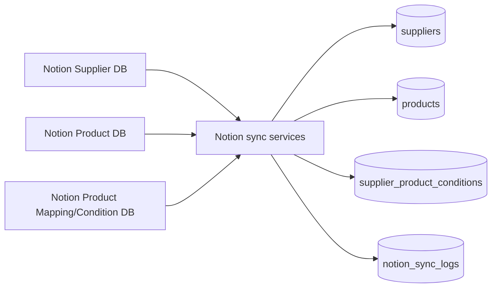

# Notion Synchronization

## Role

Notion is the intended master-data source for suppliers, ERP products, and supplier-product conditions. The ERP reads existing shared Notion databases; it does not create new Notion databases.

## Implementations in use

- `NotionSyncService` supports database discovery, target matching, preview, and integration-screen synchronization.
- `NotionLiveSyncService` performs API-based supplier/product/condition upserts and safe deactivation of missing Notion-owned rows.
- `NotionProductSyncService` provides the Product Management full synchronization entry point through `sync_products()`.
- `NotionAPIClient` handles Notion API queries and property conversion.

## Supplier sync

Supplier rows are matched primarily by `notion_page_id`, then by supplier name. New records receive a stable generated supplier code when needed. Synchronized fields include contact details, order method, courier/shipping defaults, settlement method, handled items, active state, page ID, and last-edited timestamp.

Records previously owned by Notion but absent from the current result are deactivated rather than deleted. ERP-only suppliers without a Notion page ID are not automatically removed.

## Product sync

Product rows are matched by Notion page ID, product code, and finally product name. Synchronization updates product identity, name, pricing, category, units, season, origin, packaging, sales status, supplier association, supplier product name, Notion identity, and sync status fields.

The Product Management “전체 상품 Notion” action calls `NotionProductSyncService.sync_products()`. The product list and mapping screens read the same SQLite product master, so refreshed records become available after synchronization and screen refresh.

Single-product push/sync is not supported by the current public service. Its button is intentionally disabled and labeled “선택 상품 Notion (준비 중)”.

## Product mapping / conditions

Supplier-product conditions connect products and suppliers with supplier-facing product name, price, courier, order deadline, minimum/package quantities, shipping fee, active/default state, and Notion page/timestamp fields. API synchronization marks its source as `NOTION_API` and upserts by `(product_id, supplier_id)`.

## Safety and observability

- Existing databases and configured IDs are reused.
- Tables and migrations use idempotent creation/add-column patterns.
- Missing Notion-owned rows are deactivated, not physically deleted.
- `notion_sync_logs` records created, updated, deactivated, warning, duration, status, message, and error counts.
- The settings table stores discovered/saved data-source identifiers and last synchronization state.

## Current limitations

- There are overlapping synchronization paths (`NotionSyncService`, `NotionLiveSyncService`, and the product-only service); the caller must use the correct public method.
- Single-product synchronization is unavailable.
- Property mapping depends on recognized Notion property aliases and relation structure.
- Product/supplier changes made locally can be overwritten by later Notion master synchronization.
- Notion connectivity, credentials, and shared-database permissions are external prerequisites.
- `product_suppliers` and `supplier_product_conditions` coexist; not every screen necessarily consumes the same representation.

## Future plan

1. Define one documented synchronization entry point per master domain while retaining current repositories.
2. Add explicit schema/version validation for Notion properties before applying changes.
3. Reconcile the two supplier-product representations without breaking production reads.
4. Add supported single-record refresh only after the Notion API contract is explicit.
5. Add conflict reporting and dry-run change summaries.
6. Keep Notion IDs outside source control and preserve the rule that existing databases are reused.
