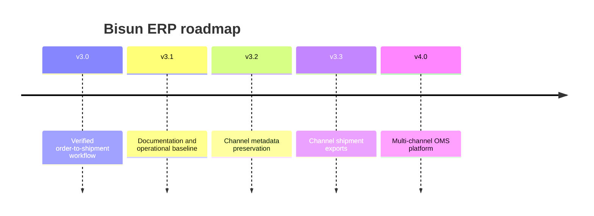

# Product Roadmap

This roadmap is based on the implementation at `v3.0-workflow-checkpoint`. Versions after v3.1 are plans, not commitments or claims of completed behavior.

## v3.0 — Workflow checkpoint

- Complete order import → auto-mapping → purchase → shipment registration path.
- Enforce mapping-complete purchase eligibility.
- Group purchase work by supplier and preserve quantities.
- Add configurable supplier shipment return formats and preview/result counts.
- Isolate local shipment success from missing Coupang API identifiers.
- Add the Command Center without replacing the existing Dashboard.
- Tag `v3.0-workflow-checkpoint` on `feature/workflow`.

## v3.1 — Documentation and stabilization

- Publish architecture, database, workflow, Notion, channel metadata, Command Center, roadmap, and changelog documentation.
- Use documentation as the release acceptance baseline.
- Continue runtime-error-only stabilization where production verification finds defects.
- Define operator runbooks and backup/restore verification before stable promotion.

## v3.2 — Metadata foundation

- Add backward-compatible generic channel metadata by order and item.
- Preserve original platform name and all imported source columns as JSON.
- Persist required Coupang and SmartStore identifiers during Excel/API imports.
- Mark unavailable identifiers on historical orders without breaking them.
- Validate metadata completeness and expose diagnostics without redesigning core screens.

## v3.3 — Shipment exports

- Implement explicit, verified Coupang and SmartStore upload schemas.
- Export only `배송중` shipments with carrier/tracking data.
- Add per-channel export logs, duplicate prevention, and explicit re-export.
- Produce dated files below `output/channel_shipments/YYYYMMDD/`.
- Add channels only after their official formats and identifiers are verified.

## v4.0 — OMS platform

- Establish adapter contracts for order intake, metadata, shipment export, and APIs.
- Support Auction, Gmarket, 11st, LotteOn, and Toss with verified schemas.
- Add resilient job execution, retry policies, audit trails, and reconciliation.
- Separate channel transport concerns from ERP workflow state while reusing production domain services.
- Add migration/version governance for schema evolution and deployment.

## Release gates

Every version should require compile checks, clean diffs, manual GUI workflow verification, data-backup validation, an explicit checkpoint tag, and no merge to `main` until operator acceptance.
