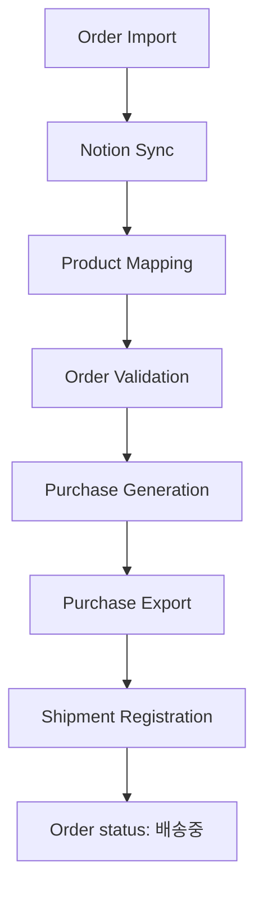
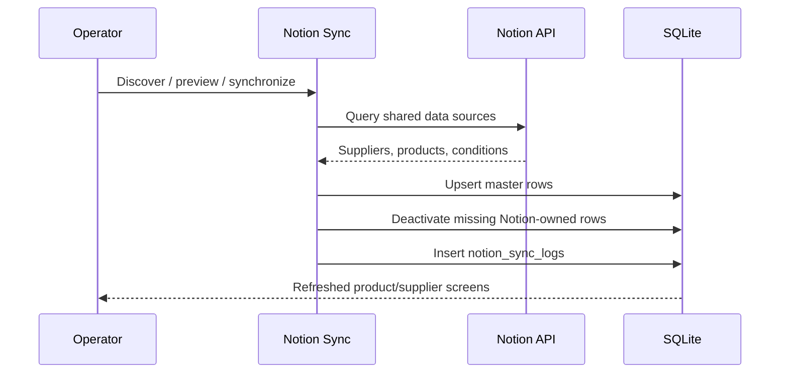
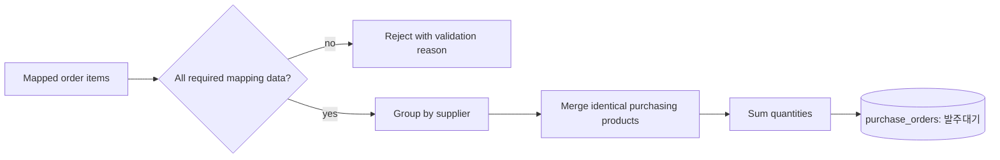
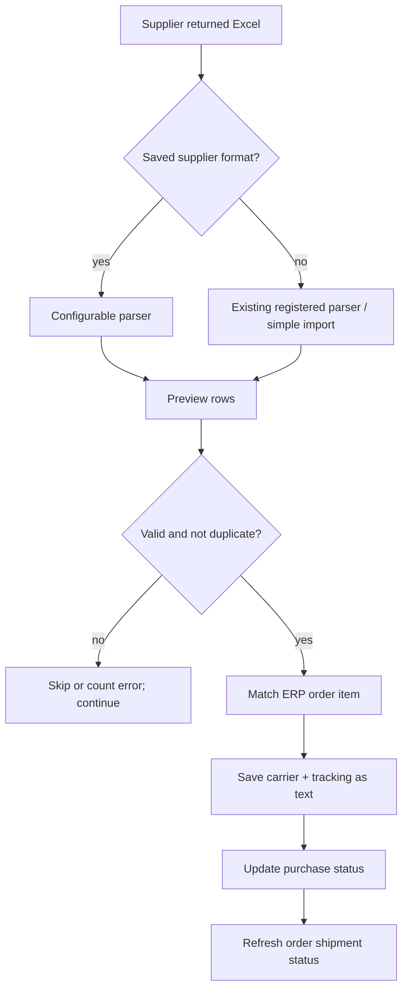

# Production Workflow

## End-to-end flow

The sequence is operational guidance. Notion master sync can be run before importing orders, but must be current before mapping and purchase generation.

## 1. Order Import

1. The operator selects one or more marketplace Excel files in Order Management.
2. `OrderExcelParser` detects a supported parser from the headers.
3. The parser normalizes channel rows into order headers and items.
4. Preview classifies rows as new, duplicate, or error.
5. `OrderRepository.create_orders_bulk()` saves new records; `(platform, order_number)` prevents duplicate order headers.
6. `OrderImportService` immediately calls automatic mapping for newly created order IDs.

Supported parser modules include Coupang, SmartStore, ESM, LotteOn, and Toss. The normalized record retains operational fields; generic raw-column preservation is not yet implemented.

## 2. Notion Sync

Notion is the intended master source for suppliers, ERP products, and supplier-product conditions. Existing IDs and relationships are preserved through page IDs and business-key matching.

## 3. Product Mapping

For each unmapped order item, production auto-mapping evaluates existing mapping/product data.

| Match result | Item/order result |
|---|---|
| Exactly one valid supplier product | `매핑완료` |
| Multiple valid candidates | `매핑필요` |
| No candidate | `미매핑` |

Manual resolution remains available from Product Mapping/Order screens. A completed mapping supplies both `product_id` and `supplier_id`, allowing purchase validation to proceed.

## 4. Order Validation

Validation checks required order, recipient, product, supplier, quantity, and purchasing information. Invalid or incomplete records remain actionable in Order Validation/Operations Check and the Command Center exception list. Validation does not silently manufacture missing master data.

## 5. Purchase Generation

Only mapping-complete candidates are eligible. The service groups output by supplier and computes purchasing fields from the existing repositories. One `purchase_orders` row is tied to one `order_item_id`, preventing accidental duplicate generation for the same item.

## 6. Purchase Export

The Purchase screen can generate all visible candidates, selected candidates, or one supplier’s purchase file. Generated workbooks are written beneath `output/발주서`. The repository records `purchase_file`, purchase status, and timestamps so the existing purchase-history view can open generated files.

## 7. Shipment Registration

Supplier formats store supplier ID, header row, order number column, carrier column, and tracking column. Blank identifiers, invalid rows, already registered items, and duplicate tracking numbers do not stop the entire import. The UI reports total, registered, skipped, and errors.

## 8. 배송중 and optional API handoff

Once shipment data is saved, the matching order moves to `배송중` and remains locally successful independent of marketplace API behavior. For Coupang:

- If `shipmentBoxId`, `orderId`, and `vendorItemId` exist, the API call is attempted and genuine errors remain visible.
- If any required identifier is missing, the API call is skipped as `API skipped (Excel order)` and no API failure log is created.
- Delivery-complete tracking and general channel upload generation are outside this checkpoint.

## Operator checkpoints

| Stage | Ready when | Blocking state |
|---|---|---|
| Import | New orders and items appear | Parser/error preview |
| Notion | Current products/suppliers visible | Sync warning/failure |
| Mapping | Order is `매핑완료` | `매핑필요` or `미매핑` |
| Validation | Required order/purchase fields valid | Exception details |
| Purchase | Purchase rows/files created | Missing supplier/product condition |
| Shipment | Tracking saved and counts reported | Invalid/duplicate/unmatched row |
| Final | Order shows `배송중` | Shipment not registered |
